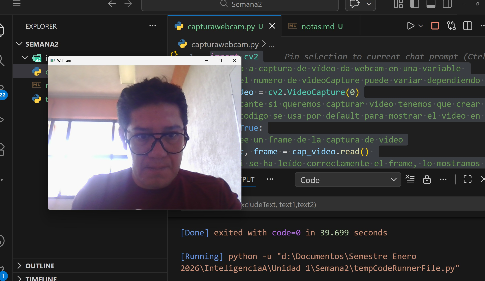
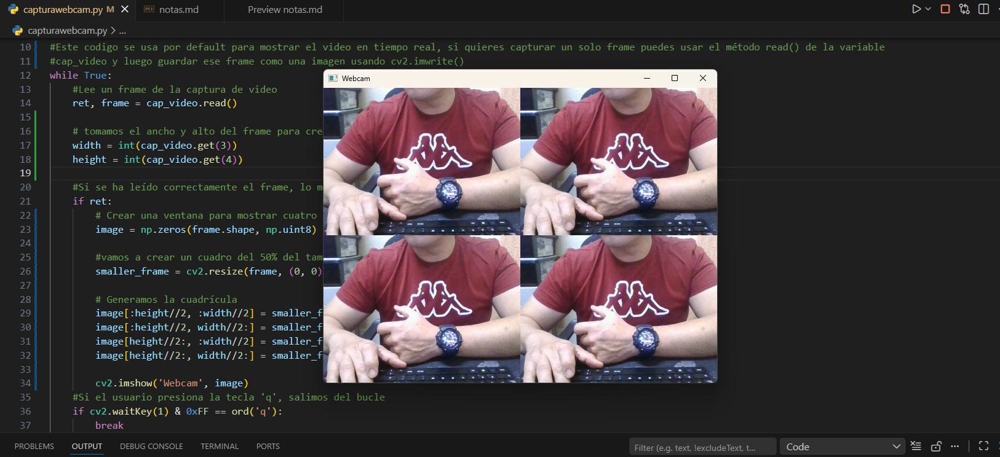

# Capturar video o imagen de web cam
    import cv2
### Inicia a captura de vídeo da webcam en una variable 
### Nota el numero de videoCapture puede variar dependiendo de la cantidad de cámaras conectadas a tu computadora, si tienes una cámara externa conectada, es posible que debas usar 1 o 2 en lugar de 0.
    cap_video = cv2.VideoCapture(0)
### importante si queremos capturar video tenemos que crear un bucle infinito para que el programa no se cierre después de capturar un solo frame
### Este codigo se usa por default para mostrar el video en tiempo real, si quieres capturar un solo frame puedes usar el método read() de la variable cap_video y luego guardar ese frame como una imagen usando cv2.imwrite()
    while True:
        ### Lee un frame de la captura de video
        ret, frame = cap_video.read() 
        ### Si se ha leído correctamente el frame, lo mostramos en una ventana
        if ret:
            cv2.imshow('Webcam', frame)   
            ### Si el usuario presiona la tecla 'q', salimos del bucle
            if cv2.waitKey(1) & 0xFF == ord('q'):
                break
### Liberamos la captura de video y cerramos todas las ventanas
    cap_video.release()
    cv2.destroyAllWindows()

# Codigo para mostrar cuatro imagenes en un recuadro

    import cv2
    import numpy as np

    cap_video = cv2.VideoCapture(0)
    while True:
        ret, frame = cap_video.read() 
        # tomamos el ancho y alto del frame para crear una imagen del mismo tamaño
        width = int(cap_video.get(3))
        height = int(cap_video.get(4))

        if ret:
            # Crear una ventana para mostrar cuatro salidas diferentes
            image = np.zeros(frame.shape, np.uint8)

            #vamos a crear un cuadro del 50% del tamaño del video original
            smaller_frame = cv2.resize(frame, (0, 0), fx=0.5, fy=0.5)

            # Generamos la cuadrícula
            image[:height//2, :width//2] = smaller_frame  # Cuadrante superior izquierdo
            image[:height//2, width//2:] = smaller_frame  # Cuadrante superior derecho
            image[height//2:, :width//2] = smaller_frame  # Cuadrante inferior izquierdo
            image[height//2:, width//2:] = smaller_frame  # Cuadrante inferior derecho

            cv2.imshow('Webcam', image)   
        
        if cv2.waitKey(1) & 0xFF == ord('q'):
            break

    cap_video.release()
    cv2.destroyAllWindows()

