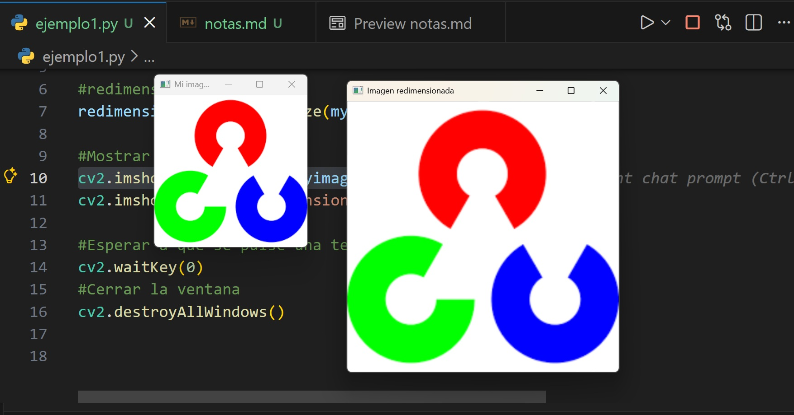
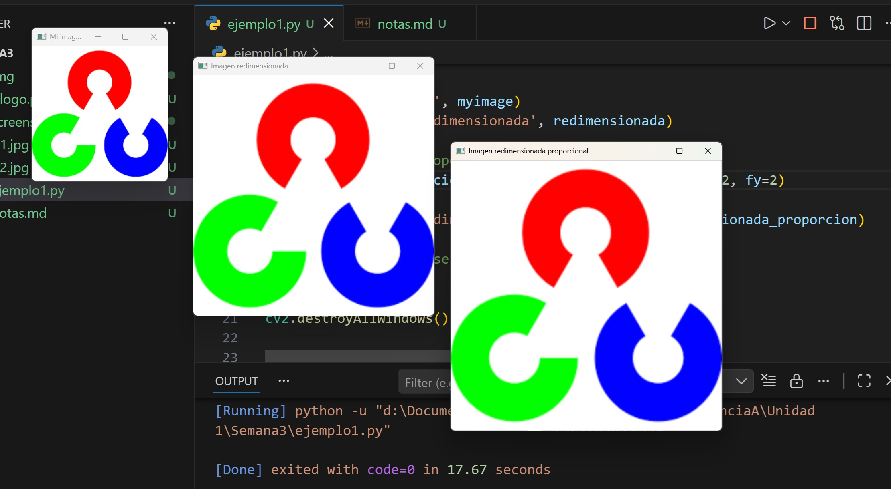
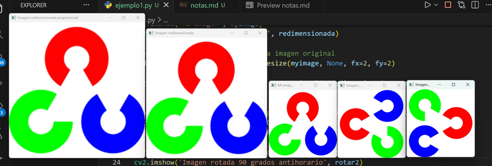
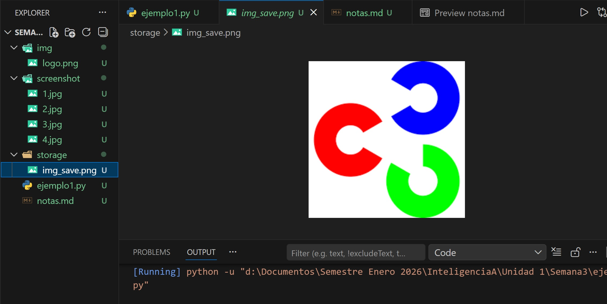

# Trabajando con imagenes en Opencv
## Agenda de este archivo
* Leer Imagen
* Redimensionar imagen
* Mostrar Imagen
* Redimensionar por proporcion
* Rotar imagen en sentido y antisentido del reloj
* Guardar una imagen en nuestro proyecto

## Leer imagen
myimage = cv2.imread('img/logo.png')

## redimensionar la imagen
redimensionada = cv2.resize(myimage, (400, 400))

## Mostrar la imagen
cv2.imshow('Mi imagen', myimage)

## Ejemplo de codigo

## Salida en pantalla

## redimencionar con proporcion a la imagen original el numero representa el % ejemplo 2 es = al doble 1.5 es igual a 150% el 1 no se usa por que quedaria igual
redimensionada_proporcion = cv2.resize(myimage, None, fx=2, fy=2)

## Salida en pantalla

## Rotar imagen en sentido y antisentido del relog por grados
#Rotar imagen tenemos 3 opciones por grado en sentido horario y antihorario
rotar = cv2.rotate(myimage, cv2.ROTATE_90_CLOCKWISE)
rotar2 = cv2.rotate(myimage, cv2.ROTATE_90_COUNTERCLOCKWISE)

cv2.imshow('Imagen rotada 90 grados horario', rotar)
cv2.imshow('Imagen rotada 90 grados antihorario', rotar2)

## Salida en pantalla

# Guardar una imagen en el disco
Podemos guardar una salida en este caso la imagen original rotada2
Solo debemos tener la carpeta de destino en la raiz del proyecto.

cv2.imwrite('storage/img_save.png', rotar2)
## Salida en pantalla

