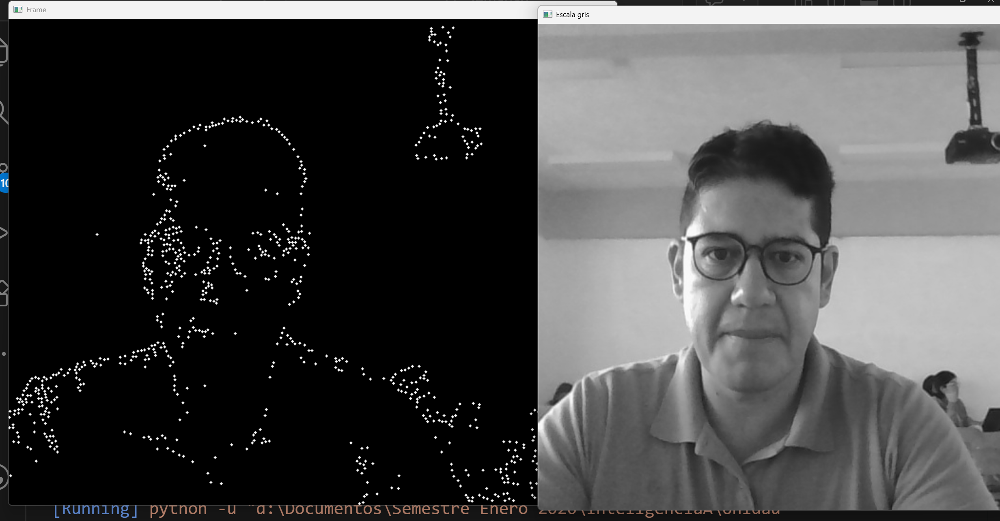

# Documentación del código Python

Este documento describe los archivos `.py` presentes en el directorio `Semana6` y explica qué hacen, cómo se programaron y cuál es el propósito de cada función o proceso.

---

## 1. `contorno.py`

**Propósito**: Cargar una imagen de tablero de ajedrez, detectar esquinas (good features) y dibujar círculos sobre ellas.

**Descripción**:
- Se importan `numpy` y `cv2` (OpenCV).
- La imagen `chessboard.png` se lee, se redimensiona al 75% y se convierte a escala de grises.
- `cv2.goodFeaturesToTrack` se utiliza para obtener hasta 100 esquinas con mínimos parámetros de calidad y distancia.
- La lista de esquinas se convierte a enteros (`np.int0`) y se recorre para dibujar un pequeño círculo azul en la imagen original.
- Finalmente, la imagen con los puntos se muestra en una ventana hasta presionar una tecla.

**Puntos clave**:
- Comprueba que `cv2.imread` no devuelve `None` antes de proceder (debe existir el archivo y la ruta ser correcta).
- La función principal de detección es `cv2.goodFeaturesToTrack`; no se definen funciones propias, todo ocurre en bloque procedimental.

---

## 2. `contornowebcam.py`

**Propósito**: Similar a `contorno.py`, pero toma fotogramas en vivo de una cámara web y dibuja tanto las esquinas detectadas como líneas aleatorias entre cada par de puntos.

**Descripción**:
- Se abre el `VideoCapture(0)` para leer desde la cámara predeterminada.
- En cada iteración del bucle `while`:
  1. Se captura un fotograma y se sincroniza el tamaño a 800x600, volteándolo horizontalmente (`flip` 1).
  2. Se convierte a escala de grises.
  3. Se detectan hasta 400 esquinas (`goodFeaturesToTrack`).
  4. Se convierte el resultado a tipo entero (`np.intp`) y se dibujan círculos blancos en la imagen del fotograma.
  5. Se genera un par de bucles `for` anidados para trazar líneas de colores aleatorios entre cada par de esquinas detectadas.
  6. Se muestra el fotograma en una ventana y se cierra el bucle al pulsar `q`.
- Al salir, se libera la captura y se destruyen todas las ventanas.

**Elementos programados**:
- No se definieron funciones auxiliares; el script es procedural.
- El bucle de líneas utiliza `np.random.randint` para elegir un color distinto para cada par.

---

## 3. `contornosvid.py`

**Propósito**: Leer de la cámara web, detectar esquinas y mostrar únicamente los puntos en un fondo negro.

**Descripción**:
- Se inicia `VideoCapture(0)`.
- Si la lectura falla, el bucle termina.
- Cada fotograma se redimensiona a 800x600 y se voltea horizontalmente.
- Se convierte a escala de grises y se buscan hasta 800 esquinas.
- Se crea una imagen negra (`np.zeros_like(frame)`) del mismo tamaño que el fotograma.
- Si se encontraron esquinas, se convierten a `np.intp` y se dibujan círculos blancos en el fondo negro.
- Se muestra la ventana con el resultado y se espera `q` para salir.
- Libera el dispositivo y cierra las ventanas al finalizar.

**Características**:
- La visualización está separada del fotograma original: solo se ven los puntos sobre negro.
- Maneja el caso en que `goodFeaturesToTrack` devuelva `None`.

---

### Observaciones generales

- Todos los scripts utilizan el mismo patrón básico de captura (imagen estática o vídeo), conversión a gris y detección de esquinas con `goodFeaturesToTrack`.
- No existen funciones definidas; el código está escrito de forma secuencial.
- Los módulos requeridos son `numpy` y `opencv-python`.
- Se recomienda añadir comprobaciones de errores al cargar imágenes y al abrir la cámara.

---

Con esta documentación tendrás un panorama claro del propósito y la estructura de cada archivo Python en este subdirectorio.

## 3. `contornosvid.py`

**Propósito**: Leer de la cámara web, detectar esquinas en cada fotograma y mostrar solamente los puntos detectados sobre un fondo negro.

**Descripción**:
- Se inicia `cv2.VideoCapture(0)` para abrir la cámara predeterminada.
- En cada iteración del bucle:
  1. Se captura un fotograma (`ret, frame`) y, si falla, se sale del bucle.
  2. Se redimensiona el fotograma a 800x600 píxeles y se voltea horizontalmente (`cv2.flip` con 1).
  3. Se convierte a escala de grises (`cv2.cvtColor`).
  4. Se detectan hasta 800 esquinas con `cv2.goodFeaturesToTrack`.
  5. Se crea una imagen negra (`np.zeros_like(frame)`) del mismo tamaño que el fotograma original.
  6. Si se detectaron esquinas (no es `None`), se convierten los puntos a enteros (`np.intp`) y se dibujan círculos blancos en el fondo negro.
  7. Se muestra la ventana con el resultado y se cierra todo al presionar `q`.

**Características**:
- El resultado no incluye el fotograma original, solo los puntos sobre fondo negro.
- Maneja el caso en que `goodFeaturesToTrack` devuelva `None` (no genera errores si no se detectan esquinas).
- Al finalizar libera la cámara (`cap.release()`) y cierra las ventanas (`cv2.destroyAllWindows()`).

---// filepath: d:\Documentos\Semestre Enero 2026\InteligenciaA\Unidad 2\Semana6\documentacion_codigo.md
## 4. `contornosvid.py alter`

**Propósito**: Leer de la cámara web, detectar esquinas en cada fotograma y mostrar solamente los puntos detectados sobre un fondo negro.

**Descripción**:
- Se inicia `cv2.VideoCapture(0)` para abrir la cámara predeterminada.
- En cada iteración del bucle:
  1. Se captura un fotograma (`ret, frame`) y, si falla, se sale del bucle.
  2. Se redimensiona el fotograma a 800x600 píxeles y se voltea horizontalmente (`cv2.flip` con 1).
  3. Se convierte a escala de grises (`cv2.cvtColor`).
  4. Se detectan hasta 800 esquinas con `cv2.goodFeaturesToTrack`.
  5. Se crea una imagen negra (`np.zeros_like(frame)`) del mismo tamaño que el fotograma original.
  6. Si se detectaron esquinas (no es `None`), se convierten los puntos a enteros (`np.intp`) y se dibujan círculos blancos en el fondo negro.
  7. Se muestra la ventana con el resultado y se cierra todo al presionar `q`.

**Características**:
- El resultado no incluye el fotograma original, solo los puntos sobre fondo negro.
- Maneja el caso en que `goodFeaturesToTrack` devuelva `None` (no genera errores si no se detectan esquinas).
- Al finalizar libera la cámara (`cap.release()`) y cierra las ventanas (`cv2.destroyAllWindows()`).

---