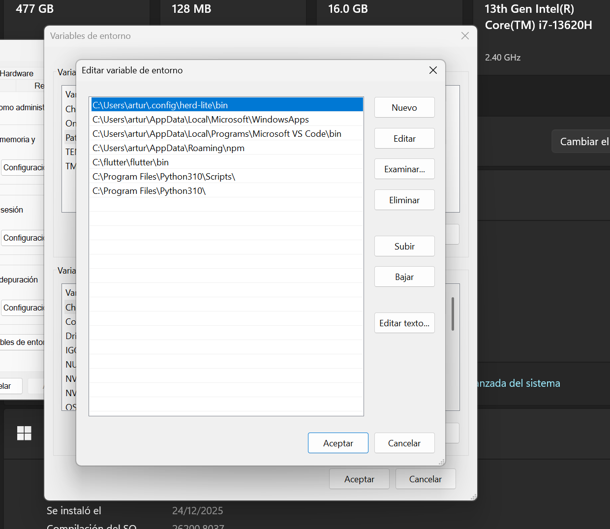
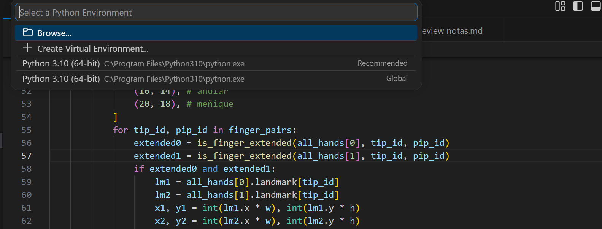

# Notas para que funcione Mediapipe
1) instalar la la version 3.10 de python la encuentras en el repositorio en la raiz
2) colocar las variables de entorno en usuario y sistema ejempplo
    
3) en la consola como administrador instalar los siguientes comandos
   1) pip install opencv-python==4.12.0.88 opencv-contrib-python==4.12.0.88
   2) pip install pip install mediapipe
4) Indicar a VSCode que se trabajara en el entorno de python 3.10
   