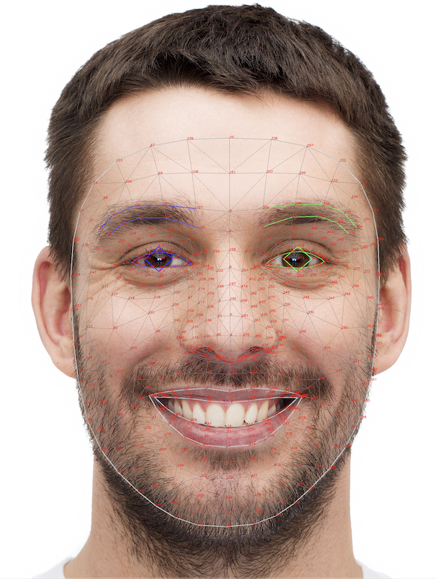

# Modelo de Deteccion MediaPipe

## Descripción del programa
Este programa utiliza MediaPipe Face Landmarker en Python para detectar rostros y puntos clave faciales (landmarks) en imágenes o video en tiempo real. A partir de la referencia de MediaPipe (https://ai.google.dev/edge/mediapipe/solutions/vision/face_landmarker/python), el flujo típico es:

1. Cargar el modelo `FaceLandmarker` con parámetros de detección (por ejemplo, `model_selection`, `min_detection_confidence`).
2. Procesar cada frame y obtener las coordenadas de los landmarks faciales (ojos, nariz, boca, contorno facial, etc.).
3. Visualizar o usar esas coordenadas para análisis/computación, como estimación de expresión, seguimiento de cabeza o filtros de realidad aumentada.

El programa está diseñado para ser ligero y apto para aplicaciones de visión por computadora en tiempo real, apoyándose en la precisión y eficiencia de MediaPipe para detección facial.

## Primer demo deteccion de Manos
La tarea de MediaPipe Hand Landmarker te permite detectar los puntos de referencia de las manos en una imagen. Puedes usar esta tarea para ubicar puntos clave de las manos y renderizar efectos visuales en ellas. Esta tarea opera en datos de imagen con un modelo de aprendizaje automático (AA) como datos estáticos o una transmisión continua, y genera puntos de referencia de la mano en coordenadas de imagen, puntos de referencia de la mano en coordenadas mundiales y lateralidad(mano izquierda o derecha) de varias manos detectadas.

