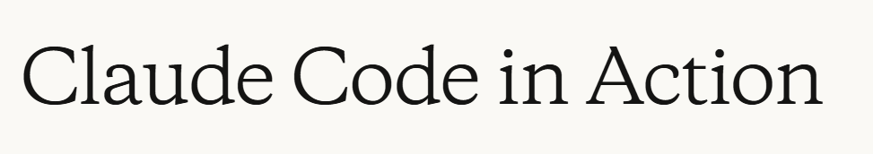

# Curso: Uso de Claude Code para Desarrollo de Software

## Acerca de este curso

Este curso ofrece una formacion integral sobre el uso de Claude Code en tareas de desarrollo de software. A lo largo del contenido, se exploran tanto los fundamentos de la arquitectura de los asistentes de programacion con IA como las tecnicas practicas para implementarlos en flujos de trabajo reales.

Tambien aprenderas a comprender la gestion de contexto dentro de Claude Code, a extender sus capacidades mediante servidores MCP y a integrarlo con GitHub para automatizar procesos de desarrollo y revision de codigo.

## Que aprenderas

- Comprender la arquitectura de los asistentes de codigo: aprenderas como los asistentes con IA interactuan con bases de codigo mediante herramientas integradas y cuales son los fundamentos tecnicos que permiten analizar y modificar proyectos.
- Explorar el sistema de uso de herramientas de Claude Code: descubriras como combinar multiples herramientas para resolver tareas complejas y de varios pasos en distintos escenarios de desarrollo.
- Dominar tecnicas de gestion de contexto: aprenderas estrategias para mantener informacion relevante durante las conversaciones y referenciar recursos del proyecto de forma efectiva.
- Implementar flujos de comunicacion visual: entenderas como utilizar entradas visuales para comunicar cambios de interfaz y aprovechar funciones avanzadas de planificacion en modificaciones complejas.
- Crear automatizaciones personalizadas: exploraras como construir comandos reutilizables y automatizaciones que agilicen tareas repetitivas de desarrollo.
- Extender funcionalidades con servidores MCP: aprenderas a integrar herramientas y servicios externos para ampliar capacidades, como automatizacion en navegador y flujos especializados.
- Integrar Claude Code con GitHub: comprenderas como configurar procesos automatizados de revision de codigo e incorporar asistencia de IA en tus flujos de control de versiones.
- Aplicar modos de pensamiento y planificacion: aprenderas cuando y como utilizar distintos enfoques de razonamiento segun el nivel de complejidad del reto de programacion.

## Prerrequisitos

- Familiaridad con interfaces de linea de comandos y operaciones en terminal.
- Conocimientos basicos de control de versiones con Git.

## Este curso esta dirigido a

- Desarrolladores de software que buscan integrar asistencia de IA en sus flujos de programacion.
- Equipos que desean implementar integraciones con GitHub impulsadas por IA en distintos procesos de trabajo.
